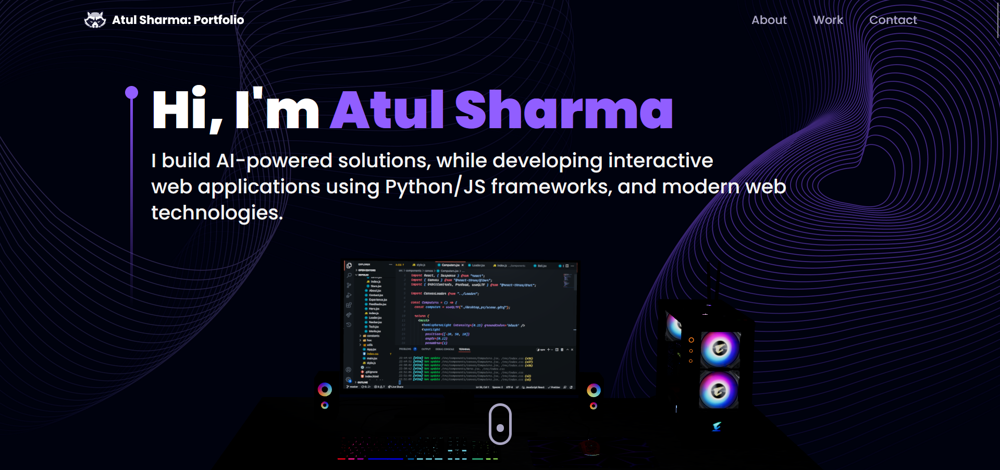

# 🌟 Atul Sharma's Portfolio

Welcome to my personal portfolio project, showcasing my skills, projects, and experiences using **Three.js**, **TypeScript**, and **Tailwind CSS**. This portfolio is designed to be interactive, modern, and responsive, highlighting my work and giving users an engaging experience.

 




## 🚀 Live Demo

Check out the live version of my portfolio [here]([https://atulsharma.vercel.app](https://atul-sharma-portfolio.vercel.app/#about)) 

## ✨ Features

- **Three.js**: Integrates 3D animations and graphics into the web for an immersive experience.
- **TypeScript**: Ensures type safety and a more maintainable codebase.
- **Tailwind CSS**: Utility-first CSS framework to build a modern and responsive design.
- **Smooth Animations**: Implemented for enhanced user interaction.
- **Responsive Design**: Optimized for various screen sizes and devices.

## 🛠️ Technologies Used

- **Three.js**: A powerful JavaScript library for rendering 3D elements.
- **TypeScript**: A superset of JavaScript that adds static types for better development.
- **Tailwind CSS**: A utility-first CSS framework for creating sleek and responsive UI.
- **Vite**: A fast and lightweight build tool for modern web projects.

## 📂 Project Structure

```bash
├── public/              # Static assets like images, models, and fonts
├── src/
│   ├── components/      # Reusable components used in the portfolio
│   ├── assets/          # 3D models, images, and textures
│   ├── styles/          # Tailwind CSS configurations and custom styles
│   ├── App.tsx          # Main React component rendering the app
│   └── index.tsx        # Application entry point
├── tailwind.config.js   # Tailwind CSS configuration
├── tsconfig.json        # TypeScript configuration
└── vite.config.ts       # Vite configuration for bundling
